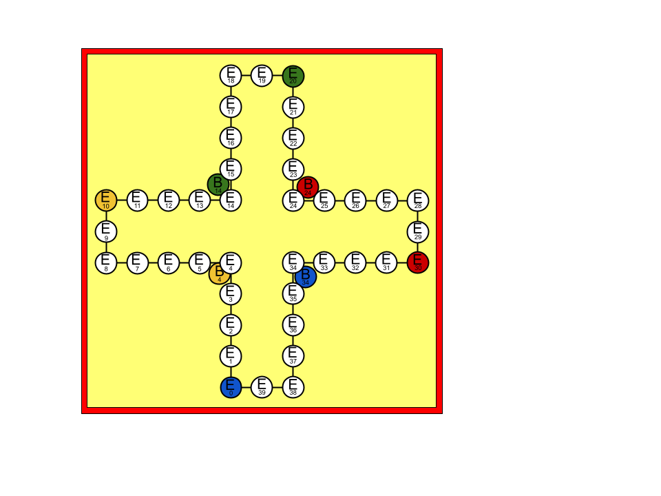

# Mens erger je niet!

This is an implementation of the Dutch board game called [Mens erger je niet!](https://nl.wikipedia.org/wiki/Mens_erger_je_niet!) based on the German game [Mensch ärgere Dich nicht](https://en.wikipedia.org/wiki/Mensch_ärgere_Dich_nicht). This in turn is derived from the Indian game [Pachisi](https://en.wikipedia.org/wiki/Pachisi). English speakers know this game as [Ludo](https://en.wikipedia.org/wiki/Ludo) while other countries have similar flavors.

This implementation is meant to make it easy to create and test a strategy, and to develop, train and have strategies compete. You might want to play around with machine learning algorithms, but find it boring to use a completely synthetic use-case.
It is relatively easy to create a strategy that ranks possible moves and that is specified by a vector of integers. These can then be played against one another and tested for fitness.

# Board

The game is played with two, or four players on the following board:

Two players play one another from opposite corners. The reverse side of the physical game board can be used for 3 or 6 players, evenly spread around th board. Note the reduced fields per player:

# Rules

Each player starts with four pawns in their respective corner, marked with B ("Begin"). Either youngest players starts, or regular 6-faced fair dice rolls can be used to determine who starts. Players take turns in a clock-wise fashion. The purpose of the game is to get all four pawns to the finish, or home, which are the four circles marked with their respective color in the center of the board, after completing a clockwise loop around the board.
For each turn a player rolls the die. If the player rolls a six, they have to move a pawn from their beginning position to their first position on the board, marked with an "A" (for "Anfang", German word for "start"?). They get to roll the die again, and move forward for the number of positions that the die shows. Then the next player takes a turn.

When a player rolls a six and none of their pawns are in their Begin area, in other words, all of them are already on the board, they can choose with which pawn to move six positions forward, and then roll again.

If another player is already in the position that your pawn would land in, you strike their pawn and send that pawn back to it's beginning position "B". Once a pawn is on one of the final home positions, they are safe from strikes. On some version of the board, the home position are marked with lower letters "a", and in some versions, "b", "c", and "d" respectively. On the four player board above only the first home position is marked, and on the image of the six-player board, none are marked. In short, you start at "B", then go to "A" then finish at "a", makes sense?

If a player has their pawn right in front of the home ("a") position and would theoretically land on another pawn that is already in a home position, that is not considered a legal move and they have to choose another pawn to move, or forfeit that turn. In other words, a pawn can land on a home spot only if that spot is not already occupied. Pawns can move forward towards an open home position.

Whether or not a player can strike their own pawn anywhere on the regular board should be agreed upon ahead of time. Even though players are unlikely to choose to strike themselves, there can be situations when this is the only option. Note that no pawn can be removed from a home position.

 # Graphical User Interface
The Graphical User Interface (GUI) contains two tabs. The first tab is the game board for four players, each with a configurable strategy.
If any of the strategies is the "ManualStrategy", the GUI will allow you to select a move by clicking on the board. 

 ## Game Board

A die in the appears in the corner of the player whos turn it is.
A dotted line in the color of the current player around a position indicates a option for a move for that player. For manual strategies, the user can click on this position to select it.
A solid line in the color of that player indicated that this position has been chosen as the next move to make.
For example, on the board below, the blue player (using a "ManualStrategy") threw a value of 2, has two options:
a) move the pawn two positions forward from E6 to E8.
b) move the pawn two positions forward from E24 to E26.
In option a) the blue player happens to strike the green player to send it's pawn home, and in option b) the blue player would strike the yellow player.

 ## Configuration

 ### Game Game
The Configure->Game menu item has four sub-menu items.
1 - Auto Select Single Choice toggle. For a manual strategy players, if there is only one option, should it be auto-selected when the game in "Play" mode, or should it pause? 
Note that if there is more than one option, the game will always pause.
2 - Playback Speed. This is where you can configure how fast the game will proceed in "Play" mode. Once the game is paused, you can proceed one step at a time.
3 - Show Position Numbers. This toggles the numbers on the board. This can be useful for debugging, or for learning the game.
4 - Stragegies configuration. This window allows users to select the strategies they want each player to use.
By default the blue player in the bottom left is configured to be the "ManualStrategy" which allows the user to select a move by clicking on the board.
By mousing-over the "B" in each players home area, the user can see the strategy that is currently configured for that player.

 # Implementation

When playing a physical board game, the location of the pawns on the board and hence the state of the game are clearly visible. For an implementation, we need an unambiguous way to refer to each position. In addition, it is convenient to choose an implementation that is easy to reason about.

 ## Numbers, modulo and layers

In order to reference an exact location on the board, let's take the perspective of the blue player in the bottom left hand corner. Given that there are ten spots for each player, and four players on this board, there are forty total spots, marked from 0 to 39.

Upon rolling a six, the blue player starts a pawn on field A, marked with 0. If they next roll a three, they move three positions forward to location marked with 3, and so on. From position 39, the blue player will have their pawns turn into the home stretch marked with "a". For example, the blue player rolls 3 from position 37 and moves to the first home position, "a". The yellow player however, will start from position marked with 10. If the yellow player has a pawn on position 36 and rolls a five, they get to move their pawn to 1. $(36+5) mod 40 = 1$

Following similar modulo logic, the blue player's starting position is equivalent to 34. After all, they have to roll a 6 to get from 34 to 0: $(34+6) mod 40 = 0$. However, no player can hit the pawns in the begin area. We can think of the begin spots as a different layer, perhaps below the regular playing field as depicted below:

The blue "begin" layer spots 35..39 are depicted with a dotted border, because they are not allowed. Only when a six is rolled can a new pawn enter the regular playing area. Let's call the regular playing area the "Event layer", marked with "E" in the diagram above. So now we have $(B34+6) mod 40 = E0$. To avoid confusion, we dropped the original "A" (from the German "Anfang" = start), and simply labeled the spot E0.
Again, following the same logic for different players, we can see that yellow starts at B4, green at B14, and red at B24. These starting positions are unique in two ways: first, only the respective color can occupy them. This is similar to the home fields. Moreover, more than one pawn can be on the same begin field.

 In this last diagram, each color's begin position is shown, but not the illegal positions. Now that we have introduced two mutually exclusive layers for begin B and event E, we can also introduce a layer for the home positions, H. From E39, a blue pawn will take one step into H0, two steps into H1, three steps into H2, and four steps into H3.

Just like we can think of the begin layer below the event layer, we can think of the home layer above the event layer. Each player has their home positions in their respective locations. Whereas for the begin position, only the first one was valid, for the home position, four separate positions are valid, and only one pawn can occupy each.
Putting this all together we get the following complete board:

 ## GUI
The GUI is built using JavaFX. The Main class launches MainApplication, which contains the GUI. 
MainApplication uses several View classes and a single Controller class that interacts with a Board object. The Board object is used to keep track of the game state and determine the legal moves for the current player. The GUI is updated based on the current state of the Board object.
The board is laid out in several PositionViews, which re-position themselves based on the width of the window as it is re-sized.

 ## Classes

 * __Layer__ : {BEGIN, EVENT, HOME}
 * __Position__ : Tuple of Layer and spot (number on the board).
 * __Move__ : Tuple of from- and to- positions.
 * __Die__ : Used to roll random numbers up to a certain number of faces.
 * __Board__ : Keeps track of game state, next player, and determines list of legal moves.
 * __History__ : Used to keep track of list of events, for example moves or scores. Accessible in forward or reverse order.
 * __BoardState__ :  A board state is essentially a list of positions for each player.
 * __Player__ :  Arranges interaction between board and a strategy. Uses the strategy to choose one of the provided possible moves. Positions of BoardState and list of allowed moves to choose from are shifted such that each strategy thinks they are playing from the bottom left position, starting at E0. This way there are not four equivalent, and functionally identical versions of each board state depending on whether a strategy is player 1, 2, 3, or 4.
 * __Score__ : Used to assign an integer value to zero, first, second, third, fourth etc player finish place using the scoring system proposed by Sitarz [[1]](#1).
 * __RuleEvaluator__ :  Used to apply the rules, determine if moves are allowed etc.
 * __Tournament__ : Used to play multiple games and keep track of score.

 * __EventCounter__ :  map of actor to event. For example, strategy name to finish place.
 * __Strategy__ : This is the thing to implement that determines what a player does during a game.

 # Strategies

In order to implement your own strategy, you need to implement the `Strategy` interface. Alternatively, you can extend the `BaseStrategy` implementation which takes care of choosing a move if only one (or even none) are allowed. This you have to bother to implement only the `multiChoose` method in which case you know for sure that there is actually something to choose (more than one option).
If your method implements some mechanism to rank the list of moves by an integer value, you can opt to extend the `RankingStrategy`.
A few example strategies that can be used as a benchmark have been included. According to Genugten & Das [[2]](#2) `FarStrategy` and `NearStrategy` (always move the pawn furthers along, or nearest the start) are simple strategies often used. They claim that `RandomStrategy`, which as you might expect makes a random selection out of the list of potential moves, is not often chosen because it is considered to be a "silly" strategy. It turns out that `FarStrategy` and `RandomStrategy` are actually reasonable benchmarks. `NearStrategy` performs particularly poorly when the game is configured to allow self-strikes.

 # Configuration

A user can provide a `mejn-user.properties` file on the classpath, or use the following [default properties](src/main/resources/mejn-default.properties):

    #
    # Board Settings
    #
    # Note that: dotsPerPlayer > dieFaces >= pawnsPerPlayer > 0
    dieFaces = 6
    pawnsPerPlayer = 4
    dotsPerPlayer = 10

    # Rules Settings
    #
    # Is a player allowed to strike themselves off the regular playing board
    #  (other than from start or into home which is never allowed)
    # isSelfStrikeAllowed is one of {true,false}
    isSelfStrikeAllowed = false

    #
    # Tournament settings
    #
    games = 10000

For a regular six player game, set the following properties:  `playerCount = 6` and `dotsPerPlayer = 8`
Strategies for a tournament are a little more structured. See [src/main/resources/mejn-strategy-config.xml](src/main/resources/mejn-strategy-config.xml) and it's corresponding [schema](src/main/resources/mejn-strategy-config.xsd). Strategies can be configured by name, providing the fully qualified classname of the implementation, and a set of parameters passed.

 ## Build

 The project is coded in Java (requires version 22+) and uses [gradle](https://docs.gradle.org/) for building, testing, and running. For example:

     /mens-erger-je-niet% gradle test

You can run a single game through:

     /mens-erger-je-niet% gradle runGame

and a tournament through:

     /mens-erger-je-niet% gradle runTournament

You can launch the GUI through:

     /mens-erger-je-niet% gradle run

You can pass parameters to gradle as follows:

	/mens-erger-je-niet% GRADLE_OPTS="-Xms1024m -Xmx2048m" time gradle runTournament

To import the project into Eclipse, use:

     /mens-erger-je-niet% gradle eclipse

For IntelliJ fans use:

     /mens-erger-je-niet% gradle idea

 ## Logging

Log4j is used for logging. The default configuration [src/main/resources/log4j2.properties](src/main/resources/log4j2.properties) a log file `target/rolling-logs/log4j-mejn.log` with up to 7 days of archives in `target/rolling-logs/log4j-mejn.log`

 ## Contributing

Contributions are welcome. Please open an issue if you see a problem, or better yet, create a fork and generate a pull request.
In order to avoid massive formatting changes, please see [Code Formatting](https://www.jetbrains.com/help/idea/migrating-from-eclipse-to-intellij-idea.html#CodeFormatting) if IntelliJ is your IDE of choice.

I would love to see other strategies implemented. There is currently no limit in time or computational resources that a strategy can take to make a decision. There are currently also no rules (yet) as to whether strategies are allowed to collaborate to gang up on other strategies.
Using reflection, or introspection to observe or manipulate other players' strategies will be considered cheating.

 ## Future work

1. Add implementation for Differential Evolution to train ranking strategies
2. Add implementation for Neural network and training of neural networks
3. Add UI to allow configured strategies to play in a tournament and show the results in a live graph

 ## License

                              Apache License
                        Version 2.0, January 2004
                     http://www.apache.org/licenses/

 ## References
 
 * <a id="1">[1] Sebastian Sitarz (2013).

   The medal points’ incenter for rankings in sport

   Applied Mathematics Letters Volume 26, Issue 4, April 2013, Pages 408-412

   [https://doi.org/10.1016/j.aml.2012.10.014](https://doi.org/10.1016/j.aml.2012.10.014)

 * <a id="2">[2] Ben van der Genugten & Marcel Das (2020).

   Strategie bij het bordspel Mens-erger- je-niet

   STAtOR Jaargang 20, nummer 2, juni 2019 pages 4-9

   https://www.vvsor.nl/wp-content/uploads/2018/01/STAtOR-2019-2-1-40-spreads-LR.pdf