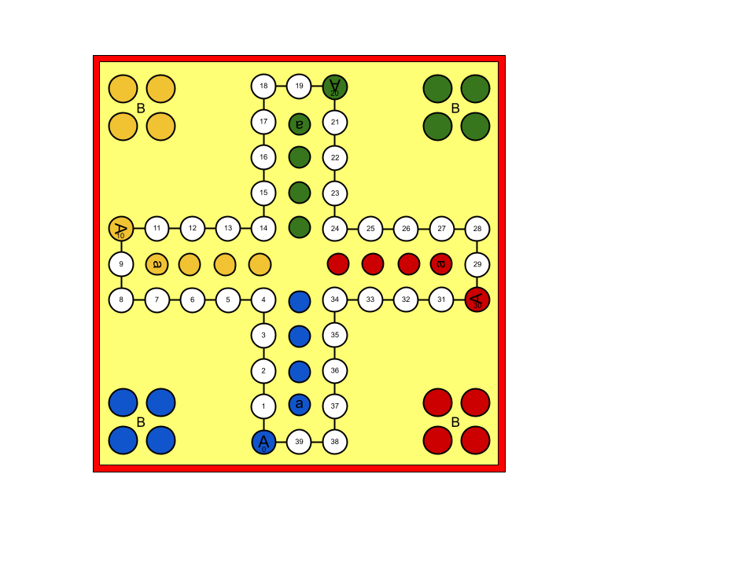
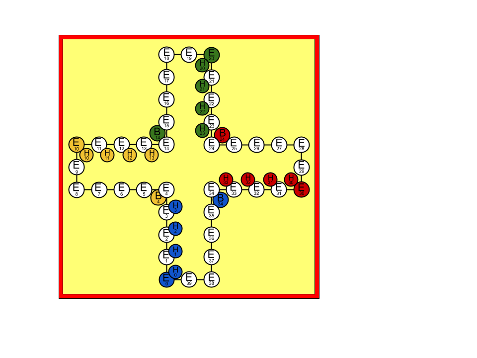

# Mens erger je niet!

This is an implementation of the Dutch board game called [Mens erger je niet!](https://nl.wikipedia.org/wiki/Mens_erger_je_niet!) based on the German game [Mensch ärgere Dich nicht](https://en.wikipedia.org/wiki/Mensch_ärgere_Dich_nicht). This in turn is derived from the Indian game [Pachisi](https://en.wikipedia.org/wiki/Pachisi). English speakers know this game as [Ludo](https://en.wikipedia.org/wiki/Ludo) while other countries have similar flavors.

This implementation is meant to make it easy to create and test a strategy, and to develop, train and have strategies compete. You might want to play around with machine learning algorithms, but find it boring to use a completely synthetic use-case.
It is relatively easy to create a strategy that ranks possible moves and that is specified by a vector of integers. These can then be played against one another and tested for fitness.

## Board

The game is played with two, or four players on the following board:

 
Two players play one another from opposite corners. The reverse side of the board can be used for 3 or 6 players:

## Board
Each player starts with four pawns in their respective corner, marked with B ("Begin"). Either youngest players starts, or regular 6-faced fair dice rolls determine who starts. Players take turns in clock-wise fashion. The purpose of the game is to get all four pawns to the finish, or home, which are the four circles marked with their respective color in the center of the board after completing a loop around the board.
For each turn a player rolls the die. If the player rolls a six, they get to move a pawn from their beginning spot to their first spot on the board, marked with an "A" (for "Anfang", German word for "start"?). They get to roll the die again, and move forward for the number of spots that the die shows. Then the next player takes a turn.

When a player rolls a six and none of their pawns are already on the board, they can choose with which pawn to move six positions forward, and then roll again.

If another player is already in the position that your pawn would land in, you strike their pawn and send that pawn back to it's beginning spot "B". Once a pawn is on the final home spots, they are safe from strikes. The home spots are marked with lower letters "a", and in some versions, "b", "c", and "d" respectively. In short, you start at "B", then go to "A" then finish at "a", makes sense? If a player has their pawn right in front of the home ("a") spot and would theoretically land on another pawn, that is not considered a legal move and they have to choose another pawn to move, or forfeit that turn.

### Numbers, modulo and layers
In order to reference an exact location on the board, let's take the perspective of the blue player in the bottom left hand corner. Given that there are ten spots for each player, and four players on this board, there are forty total spots, marked from 0 to 39.

  
Upon rolling a six, the blue player starts a pawn on field A, marked with 0. If they next roll a three, they move three positions forward to location marked with 3, and so on. From position 39, the blue player will have their pawns turn into the home stretch marked with "a". For example, the blue player rolls 3 from position 37 and moves to the first home position, "a". The yellow player however, will start from position marked with 10. If the yellow player has a pawn on position 36 and rolls a five, they get to move their pawn to 1. $36+5 mod 40 = 1$

Following similar modulo logic, the blue player's starting position is equivalent to 34. After all, they have to roll a 6 to get from 34 to 0: $34+6 mod 40 = 0$. However, no player can hit the pawns in the begin area. We can think of the begin spots as a different layer, perhaps below the regular playing field as depicted below:

The blue "begin" layer spots 35..39 are depicted with a dotted border, because they are not allowed. Only when a six is rolled can a new pawn enter the regular playing area. Let's call the regular playing area the "Event layer", marked with "E" in the diagram above. So now we have $B34+6 mod 40 = E0$. To avoid confusion, we dropped the original "A" (from the Germain "Anfang" = start), and simply labeled the spot E0.
Again, following the same logic for different players, we can see that yellow starts at B4, green at B14, and red at B24. These starting positions are unique in two ways: first, only the respective color can occupy them. This is similar to the home fields. Moreover, more than one pawn can be on the same begin field.

  
 In this last diagram, each color's begin position is shown, but not the illegal positions. Now that we have introduced two mutually exclusive layers for begin B and event E, we can also introduce a layer for the home positions, H. From E39, a blue pawn will take one step into H0, two steps into H1, three steps into H2, and four steps into H3. Just like we can think of the begin layer below the event layer, we can think of the home layer above the event layer.
 
 Putting this all together we get the following complete board:
 

 
 